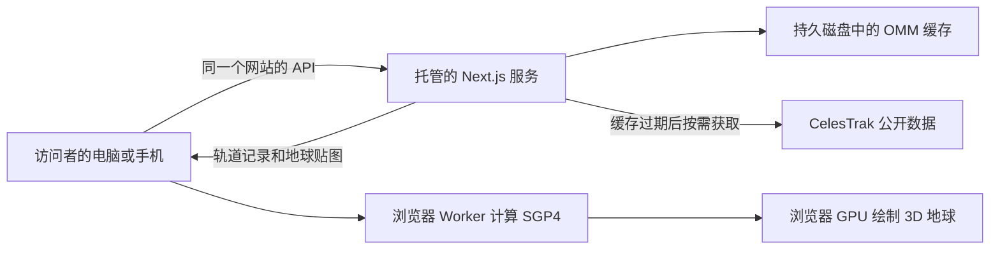

# 发布与数据运行

历史发布记录中的 Sites 版本：[既有网址](https://orbital-field.zzyyss298.chatgpt.site)。历史记录中的访问范围为公开；本次合并不重新验证或更改其部署状态。该托管版在独立 Sites 项目中维护，历史工作区的 `cloud/` 目录并未包含在此 GitHub checkout 中，详见 [公开发布记录](sites-publication.md)。合并 GitHub 代码不会更新现有 Sites 网站。下面的 Node.js、Render 与 Docker 内容保留为原版运行和其他平台部署参考；本次没有开通 Render 付费服务。

本项目需要运行 Next.js 的 Node.js 服务。服务由云平台托管后，访问者打开网址即可使用，你的开发电脑可以关机。轨道数据不需要逐台复制，也不需要访问你的电脑。

## 数据如何运行



| 内容 | 保存或运行的位置 | 换电脑后 |
|---|---|---|
| 轨道记录、数据下载状态 | 云端的持久缓存目录 | 从同一个云端接口读取 |
| 地球贴图、页面、Worker | 生产包内 | 网站自动提供 |
| 轨道计算与 3D 绘制 | 访问者的浏览器 | 使用该设备的 CPU/GPU |
| 关注列表、语言和面板偏好 | 该浏览器的 localStorage | 不自动同步；目前没有账号系统 |
| 手动或浏览器定位的观测点 | 当前页面状态 | 在新设备重新设置或定位 |

页面默认只加载 `active`，其他目录由用户选择后加载。正常缓存有效期为 4 小时；页面中的运动由 SGP4 在浏览器内计算，不表示上游每秒发布新观测数据。长时间打开页面时，可使用刷新数据按钮重新请求网站接口；服务仍遵守缓存有效期。

[CelesTrak 官方说明](https://celestrak.org/NORAD/documentation/gp-data-formats.php)要求避免重复下载、不预取不需要的目录，并检查失败响应。服务合并同一分组的并发请求，网络或服务失败后至少冷却 2 小时；`403`/`404` 会保存阻断状态，停止自动下载，已有数据继续以旧缓存状态提供。首次下载失败时没有可用数据，页面会显示错误。

## 推荐：托管 Node.js 服务与持久磁盘

当前文件缓存适合一个 Node.js 实例配一块持久磁盘。仓库已提供 [Render Blueprint](../render.yaml)，也可以在支持 Node.js 与持久磁盘的其他托管平台使用同样配置。

Render 的持久磁盘需要付费服务；创建服务前在平台确认计算资源、磁盘和流量费用。配置文件只是部署描述，提交它不会代你创建服务或开通计费。配置使用一个实例，避免各实例分别访问上游。

1. 将本次代码提交并推送到你的 GitHub 仓库。
2. 在 Render 创建 **Blueprint**，选择该仓库及发布分支，读取根目录的 `render.yaml`。
3. 检查服务套餐和 1 GB 持久磁盘，确认 `CELESTRAK_CACHE_DIR=/var/data/celestrak` 与磁盘挂载路径 `/var/data`。
4. 平台执行 `npm ci --no-audit --no-fund && npm run build`，然后 `npm run start:standalone`。
5. 打开平台给出的 HTTPS 地址。`/api/health` 应返回 HTTP 200，`cache.writable` 应为 `true`；`/api/gp?group=active` 应有记录和真实的 `fetchedAt`。
6. 重启服务后再次访问；缓存时间和记录应保留，缓存尚未过期时不应重新下载上游。

生产构建不会预取轨道数据。首次有人选择目录时，云端下载对应数据并写入磁盘。健康检查只读取缓存状态与目录权限，不访问 CelesTrak。健康接口中的 `degraded` 表示存在上游错误，需要查看目录状态和服务日志；它不表示页面必须停止服务。缓存目录不可读写时健康检查返回 503。

平台必须允许出站访问 `https://celestrak.org`。共用出口 IP 可能已被其他应用限制；浏览器在你本机能访问数据，不能证明云平台出口也能访问。上线时必须在真实部署地址检查数据接口。

## Docker 与另一台电脑

`Dockerfile` 使用 Next.js standalone 生产包，只带运行需要的依赖、静态文件和 Worker。运行前安装 Docker；不要把本机 `node_modules` 或 `.next` 从 Windows 直接作为 Linux 运行依赖复制。

```bash
docker build -t orbital-field .
docker run -d --name orbital-field -p 3000:3000 --mount type=volume,source=orbital-field-cache,target=/app/.cache orbital-field
```

打开 `http://localhost:3000`。命名卷保存轨道缓存，替换容器时继续挂载同一个卷。镜像以 UID 1001 运行；如果改用主机目录挂载，保证 UID 1001 可读写该目录。云平台按自身要求映射端口和配置 HTTPS。

另一台电脑也可以安装 Node.js **22.12+ 的 22.x 或 24.x**，克隆代码后运行：

```bash
npm ci
npm run build
npm run start:standalone
```

随后打开 `http://localhost:3000`。这是该电脑独立运行应用；每个独立部署拥有自己的缓存。访问已发布的网址时，不需要安装 Node.js、Docker 或复制数据。

## Vercel、静态托管与免费方案的边界

默认 Node.js 模式不能直接作为 GitHub Pages 的纯静态网站运行，因为 `/api/gp` 在服务器端访问上游；仓库另有独立的[静态快照构建](static-mirror.md)。Vercel 普通函数也不是现有接口的直接替代：本地文件缓存无法共享并保证重启后保留，而且 [函数响应体上限为 4.5 MB](https://vercel.com/docs/functions/limitations)，全量 `active` OMM JSON 可超过该限制。

若以后选择 Vercel，需要将缓存迁移到共享存储，并将大目录通过对象存储/CDN或分页提供。只把缓存目录改到 `/tmp`，不能解决重启、并发实例和上游下载限制。

静态快照模式已实现独立数据入口、快照准备与失败保留策略。轨道位置仍在浏览器计算，但数据更新依赖另行运行快照更新与发布流程。本文其余配置描述托管 Node.js 模式；构建静态文件不等于已经发布或启用定时更新。

## 失败后如何恢复

出现 `403`/`404` 时，先检查云端日志中的分组与状态码，确认查询仍有效、出口 IP 未受限制，以及没有另一套进程重复下载。不要把反复刷新或删掉所有缓存作为恢复方法。

原因解决后，在服务端设置相同的 `CELESTRAK_CACHE_DIR`，执行：

```bash
npm run cache:resume -- active
```

这个命令只清除该分组的错误、下次重试时间和阻断标记，保留已有轨道记录。然后重启服务，清除进程内状态。Docker 镜像中可执行 `docker exec orbital-field node scripts/resume-source.cjs active`，再执行 `docker restart orbital-field`。其他分组使用对应的目录 ID。

数据源不可用且没有历史缓存时，无法显示真实卫星；有缓存时继续显示并标记数据过期。缓存写失败时会记录日志，并在当前进程用内存保留有效数据；这只是故障兜底，持久磁盘仍是正式发布要求。

## 发布检查

```bash
npm run typecheck
npm run lint
npm test
npm run build
npm run start:standalone
```

在另一个终端设置目标网址并运行浏览器检查。脚本使用系统 Chrome；也可以设置 `BROWSER_CHANNEL=msedge`。PowerShell 示例：

```powershell
$env:TARGET_URL = 'http://localhost:3000'
npm run verify:runtime
npm run verify:smoke
```

脚本遇到页面错误、失败资源、零个传播对象或缺少 Worker 时返回非零退出码。冒烟截图保存在 `output/playwright/perf-smoke.png`，帧时间用于观察当前设备，不能代表所有访问者的帧率。

如果外部数据源暂时不可用，可以显式设置 `VERIFY_GP_FIXTURE` 为本地 OMM JSON 数组或包含 `records` 的缓存 JSON 文件，再运行上述脚本。报告会标记 `fixtureMode: true`；这只验证浏览器与计算链路，不能作为上游联网或云端数据可用的证据。正式发布验证时移除该变量。

上线验收还应确认 HTTPS、手机布局、Worker/贴图资源正常、默认只请求 `active`、真实数据接口可用，并完成一次保留缓存的云端重启。开发环境或本地 standalone 验证不能替代平台上的这些检查。

资料依据：[Next.js standalone](https://nextjs.org/docs/app/api-reference/config/next-config-js/output)、[Render 持久磁盘](https://render.com/docs/disks)、[Render Blueprint](https://render.com/docs/blueprint-spec)。
